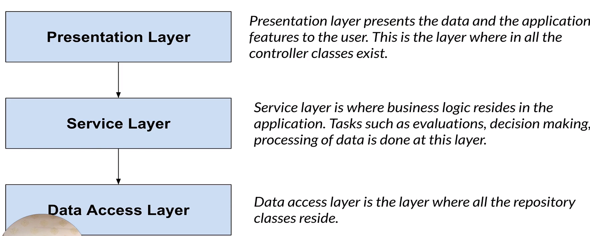
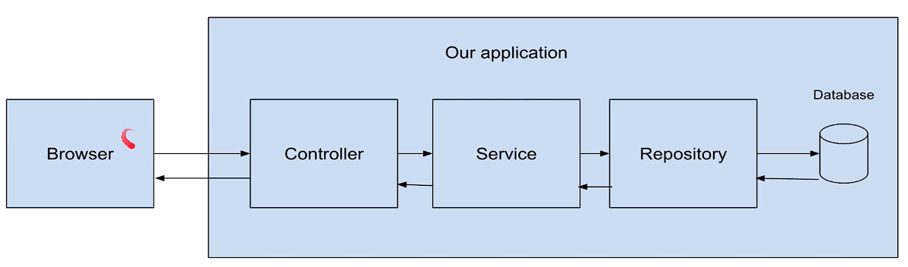

# Learn-SpringBoot
This Repository contains SpringBoot Implementation

## Tools Required : 
1. Java jdk 15 and above
2. Intellj Idea

# Spring Framework
1. Spring is one of the most popular java framework.
2. Open source Java Platform.
3. Released by Rad Johnson.
4. First version was released under apache 2.0 license in 2003. 

### Features 
1. Modularity
2. Support existing technologies
3. lightweight

### Problems with Spring Framework 
1. Lots of boiler plate code is needed to be written.
2. Lots of configuration - multiple configuration steps.
3. multiple steps to build and deploy the application.

# SpringBoot Framework
1. SpringBoot is one of the most popular java framework.
2. Open source Java Platform.
3. It's a module of spring framework which allows us to build production ready apps quickly.
4. Let's not focus on configuration, setup and deployment anymore.
5. Spring Boot = Spring Framework + Prebuilt configuration + embedded servers

### Features
1. Allows us to create standalone application with minimum development time.
2. Provides a spring starter project which helps you get start quickly.
3. Auto configuration of dependencies.
4. It has embedded servers.
5. Reduces the cost of code and development time of the application.
6. Makes it easier to integrate with other framework like sturts, hibernates etc.

### Why developers love spring boot ?
1. Java based.
2. Reduced development time.
3. Easier to write test cases with integration of testing framework.
4. Has embedded servers (Tomcat or jetty) for deployment. 
5. Has various plugins that developers can make use of
6. Avoid writing boilerplate code, configuration etc.

## Spring vs Spring Boot
1. Spring framework is a java based web framework used to build web applications. Its main feature is to provide dependency injection
   which helps you develop applications in a loosely coupled fashion
2. Spring framework is a java based web framework used to build web application. 
   Spring boot is a module of string framework which allows us to build production ready apps quickly.
3. Developers have to write a lot of boilerplate code to do simple tasks.
   Developers don't have to write boilerplate code to do simple tasks
4. Developers have to do some configuration tasks before writing actual code. Dependencies have to be defined manually in pom.xml.
   Spring boot comes with a starter project with pre-defined dependencies that are basically required to build a web application.
5. To run a spring application we have to set up a server like tomcat and deploy the application on the server.
   Spring boot offers an embedded server where the application is deployed. You don't have to set this server explicitly this is inbuilt.
6. Spring does not provide support to in Spring boot offer support to in memory database. database like H2

## Different tier

# Apis
1. It stands for Application Programming Interface.
2. Used to get the data on the server.
3. Allows you to expose api's of your application which other apps can consume.
4. Api's expose data which can be consumed by other application. 

### Why use Apis ?
1. Dynamic data
2. Promote reusability
3. Allow you to use existing service

### Types of Api's 
1. Internal Api's
2. External Api's
3. Partner Api's
